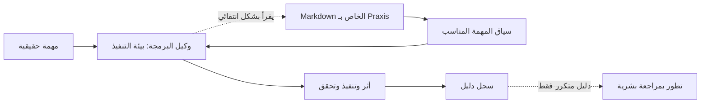

# NassAI-Praxis

> **NassAI-Praxis طبقة وصفية تعتمد Markdown وGit لتنظيم معرفة المشروع والمهارات القابلة لإعادة الاستخدام والتطور الذي يراجعه الإنسان عبر جلسات وكلاء البرمجة.**

[](CHANGELOG.md) [](LICENSE) [](docs/COMPATIBILITY_MATRIX.md) [](PRAXIS.md) [](personas/)

```bash
git clone https://github.com/NasserJabir/NassAI-Praxis.git
```

التفاصيل التقنية الأساسية مكتوبة بالإنجليزية، بينما تدعم الشخصيات والمجتمع والشرح ثنائي اللغة عند الحاجة. اقرأ [النسخة الإنجليزية](README.md) للمواصفات التفصيلية.

## لماذا Praxis؟

- **الوكيل ينسى كل شيء بين الجلسات.**
- **فريقك يعيد شرح الاصطلاحات كل يوم.**
- **مشروعك يفتقر إلى ذاكرة مؤسسية قابلة للمراجعة.**

## ما هو Praxis وما ليس كذلك؟

| Praxis هو | Praxis ليس |
|---|---|
| بنية معرفة قابلة للقراءة والمراجعة عبر Git لحفظ قرارات المشروع وإجراءاته. | Runtime أو قاعدة بيانات أو مخزن متجهات أو خادم أو daemon أو CLI إلزامي. |
| طبقة يمكن لإضافات الوكلاء قراءتها عندما تناسب المهمة. | ضمانًا بأن كل وكيل سيكتشف كل المعرفة أو يستخدمها تلقائيًا. |
| مسار تطور يبدأ بالدليل وينتهي بموافقة بشرية. | تعديلًا ذاتيًا مستقلًا أو ترقية تلقائية إلى Core. |

## نظرة بصرية



الوكيل هو من ينفذ العمل، أما Praxis فهو طبقة معرفة قابلة للقراءة قد يرجع إليها عندما يكون السياق مناسبًا. يشرح [الدليل البصري](docs/VISUAL_GUIDE.md) المكونات وتدفق العمل العادي ودور Persona وسلم الأدلة E0–E5.

## Personas: كيف تُتخذ القرارات؟

إن **Persona** ملف تعريف لنمط التفكير بصيغة Markdown ومُدار بالإصدارات. يوضح الهوية ومبادئ التفكير واتخاذ القرار والخبرة المنسقة والأولويات وتحمل المخاطر وأسئلة المراجعة وأسلوب التواصل. وهي تكمل دور الـAgent وطريقة الـSkill ومعرفة المشروع في Memory، ولا تستبدل أيًا منها. يمكن أن تشير Persona إلى معرفة المشروع والمهارات الأساسية عندما تكون ملائمة، لكنها لا تملك نظام ذاكرة ولا مهارات أساسية، ولا يوفر Praxis نقل معرفة تلقائيًا بين المشاريع. تفيد خصوصًا في المفاضلات المعمارية والأمنية وتجربة المستخدم، وقد لا تحتاجها مهمة صغيرة.

يمكن لعدة جلسات قراءة Persona واحدة بالتوازي. ولا يتغير ملفها الأساسي إلا عبر **دليل → مرشح → مراجعة بشرية → Markdown معتمد**، من دون قفل تقني أو تعلّم تلقائي أو تعديل ذاتي. راجع [دليل Personas](docs/PERSONAS.md) و[مراجعة معمارية Persona](docs/PERSONA_ARCHITECTURE_REVIEW.md) و[المخطط البصري](docs/VISUAL_GUIDE.md#3-what-a-persona-adds).

## البدء السريع

### تطبيق Praxis في مشروع قائم

ابدأ من المشروع الحقيقي الذي تريد أن يحتفظ وكيل البرمجة بسياقه القابل للمراجعة. اختر الوكيل الذي تستخدمه واتبع إعداد **التثبيت المحلي داخل المشروع** في [`INSTALL.md`](INSTALL.md#recommended-project-local-installation). هذا هو المسار الموصى به: ينسخ إضافة المضيف وطبقة Markdown إلى المشروع نفسه، من دون إنشاء Runtime أو قاعدة بيانات أو خدمة.

### بدء مشروع جديد من مجلد البداية

المجلد [`template/`](template/) هو مجلد بداية قابل للنسخ، وليس مستودع GitHub Template مفعّلًا. اتبع [`template/README.md`](template/README.md) لنسخه إلى مشروع جديد، ثم استخدم مسار التثبيت المحلي نفسه.

### تهيئة المشروع تلقائيًا (اختياري)

```bash
node /path/to/NassAI-Praxis/scripts/praxis-init.js /path/to/your-project
```

يتعرف `praxis-init` على تقنيات مشروعك (React أو Laravel أو Go أو Docker...) وينشئ ملفات `CLAUDE.md` و`AGENTS.md` الابتدائية مع المهارات الموصى بها وذاكرة العمل. لا يستبدل أي ملف موجود أبدًا، ويطبع ملخصًا واضحًا بما أنشأه وتجاوزه. هذه الأداة اختيارية — يعمل Praxis بدونها.

### اكتشاف المهارات عبر PRAXIS.md

يجب أن يبدأ الوكيل من [`PRAXIS.md`](PRAXIS.md) — فهرس مُولَّد لجميع المهارات يتضمن شروط التفعيل («متى تُحمَّل») والتكلفة التقريبية بالرموز. يمسح الوكيل الجدول أولًا، ثم يحمّل فقط ملفات SKILL.md التي تناسب المهمة، ضمن **ميزانية استرشادية ~8K رمز افتراضيًا** (عدّلها حسب المضيف والنموذج ونافذة السياق). ملف PRAXIS.md مُولَّد؛ تبقى ملفات SKILL.md هي المصدر الأساسي.

### أول نتيجة مفيدة — وليست بروتوكول تحقق

```text
ثبّت Praxis داخل مشروع حقيقي
  ↓
ابدأ وكيل البرمجة داخل ذلك المشروع
  ↓
اطلب منه قراءة السياق المرتبط بالمهمة
  ↓
أعطه مهمة حقيقية محدودة
  ↓
راقب هل يستشهد بمعرفة المشروع المناسبة ويستخدمها
```

للملاحظة الأولى، اسأل: **«اقرأ سياق Praxis الخاص بمشروعي وأخبرني بالاتفاقيات النشطة وملفات مصدرها.»** يجب أن تحدد النتيجة المفيدة مصدر Markdown ذا الصلة، مثل `memory/semantic/conventions.md`؛ لكنها ليست ضمانًا بأن كل مضيف سيكتشف كل ملف تلقائيًا. تابع بمهمة حقيقية منخفضة المخاطر وراقب النتيجة. استخدم [`docs/AGENT_TESTING.md`](docs/AGENT_TESTING.md) فقط عندما تريد إجراء بروتوكول تحقق منفصل للتكامل.

اتبع دليل [البدء خلال خمس دقائق](GETTING_STARTED.md) للتفاصيل.

## حالة الدليل

سجلت عينة مضبوطة تاريخية من Phase 1 مؤشرات مواتية خاصة بتلك المهمة، وما زالت آثارها وتقريرها متاحة في [أرشيف المقارنة](benchmarks/benchmark-001/report.md). لكن المقارنتين Baseline 001 وBaseline 002 اللاحقتين هما **ملاحظتان غير حاسمتين لوجود أفضلية أداء عامة**. يدعم الدليل ملاحظات محدودة عن الاستمرارية والتطور والشخصيات، ولا يدعم ادعاءً عامًا عن السرعة أو الرموز أو الجودة. راجع [نتائج التحقق](docs/VALIDATION_RESULTS.md) و[فهرس التحقق](docs/VALIDATION_INDEX.md).

## الوكلاء المدعومون

| الوكيل | الذاكرة | المهارات | الميزانية |
|---|---|---|---|
| Claude Code | كاملة | كاملة | 8K / 200K |
| Cursor | كاملة | كاملة | 8K / 128K |
| Copilot | خفيفة | كاملة | 2K / 8K |
| Kimi | كاملة | كاملة | 10K / 200K+ |
| Codex | كاملة | كاملة | 8K / 128K |
| Gemini CLI | كاملة | كاملة | 15K / 1M+ |
| OpenCode | كاملة | كاملة | 5K–10K |
| Pi | خفيفة | خفيفة | 3K |
| Windsurf | كاملة | كاملة | 8K / 128K |

الشخصيات العربية المدعومة هي: حسن، يوسف، ليلى، عمر، فاطمة، خالد، ياسمين، عمرو، نور، وسامي.

للمقارنة التفصيلية، راجع [مصفوفة التوافق](docs/COMPATIBILITY_MATRIX.md).

## بنية المشروع

```text
praxis.config.md       الإعدادات والميزانيات
PRAXIS.md              فهرس المهارات المُولَّد (شروط التفعيل والتكلفة)
memory/                الذاكرة والأمان
skills/                59 مهارة قابلة لإعادة الاستخدام (ملفات SKILL.md هي المصدر الأساسي)
agents/                12 وكيلًا متخصصًا
personas/              10 شخصيات سلوكية
evolve/                التقييم والتحسين
scripts/               أدوات اختيارية: بناء، تحقق، تهيئة
docs/                  التكامل والتوثيق
template/              ملفات بدء مشروع جديد
```

## التوثيق

[INSTALL.md](INSTALL.md) · [GETTING_STARTED.md](GETTING_STARTED.md) · [POSITIONING.md](POSITIONING.md) · [FAQ.md](FAQ.md) · [CONTRIBUTING.md](CONTRIBUTING.md) · [docs/](docs/)

## المجتمع والأمان والإصدارات

[CODE_OF_CONDUCT.md](CODE_OF_CONDUCT.md) · [SECURITY.md](SECURITY.md) · [SUPPORT.md](SUPPORT.md) · [GOVERNANCE.md](GOVERNANCE.md) · [RELEASE_PROCESS.md](docs/RELEASE_PROCESS.md) · [MAINTAINER_CHECKLIST.md](docs/MAINTAINER_CHECKLIST.md) · [CHANGELOG.md](CHANGELOG.md)

## المساهمة

نرحب بالمهارات والوكلاء والشخصيات والإضافات والترجمات وتحسين التوثيق. اقرأ [دليل المساهمة](CONTRIBUTING.md) لمعرفة القوالب ومسارات العمل وبوابات الجودة.

## الترخيص

MIT — راجع [LICENSE](LICENSE).

## قبل / بعد Praxis

بدون Praxis قد يضطر الوكيل إلى طلب شرح المعمارية والاتفاقيات في كل جلسة. ومع Praxis يمكنه، عندما تكون المعرفة مناسبة للمهمة ويصل إليها، قراءة الشخصيات والذاكرة والمهارات والقرارات والأنماط من ملفات Markdown المشتركة.

راجع [مثال Todo API](examples/todo-api/README.md) و[وثيقة المعمارية](docs/ARCHITECTURE.md) و[بروتوكول التحقق](docs/VALIDATION_PROTOCOL.md).
