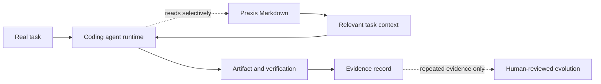

# NassAI-Praxis

> **NassAI-Praxis is a Markdown-first, Git-native declarative layer for project knowledge, reusable skills, and human-reviewed evolution across coding-agent sessions.**

[](CHANGELOG.md) [](LICENSE) [](docs/COMPATIBILITY_MATRIX.md) [](skills/) [](personas/)

```bash
git clone https://github.com/NasserJabir/NassAI-Praxis.git
```

## Definition

> **NassAI-Praxis is a Markdown-first, runtime-independent framework for defining persistent knowledge, specialized behavior, reusable skills, project memory, and explicit learning loops for AI coding agents.**

> **Praxis does not execute agents. It gives coding agents a structured way to remember, reason, work, evaluate, and evolve.**

## What Praxis Is—and Is Not

| Praxis is | Praxis is not |
|---|---|
| A human-readable, Git-reviewable structure for project knowledge, procedures, and decisions. | An agent runtime, database, vector store, server, daemon, queue, or mandatory CLI. |
| A portable layer that agent adapters can read when relevant to a task. | A guarantee that every agent will automatically discover or apply every file. |
| An evidence-first evolution process in which people approve reusable changes. | Autonomous self-modification or automatic promotion into Core. |

## Visual Overview



The coding agent executes. Praxis is the readable project layer it may consult when context is relevant. The full [visual guide](docs/VISUAL_GUIDE.md) explains the components, normal task flow, Persona behavior, and the E0–E5 evidence ladder.

## Personas: How Decisions Are Approached

A **Persona** makes a task’s reasoning style explicit: priorities, risk tolerance, review questions, and communication style. It complements rather than replaces an Agent role, a Skill procedure, or project Memory. Personas are especially useful for meaningful trade-offs such as security, architecture, and user experience; they are optional for small tasks.

The same Persona may be read concurrently by multiple sessions. Its canonical Markdown definition changes only through **evidence → proposal → human review**, with no runtime lock or automatic mutation. Read the [Persona guide](docs/PERSONAS.md) and the [visual composition diagram](docs/VISUAL_GUIDE.md#3-what-a-persona-adds).

## Why Praxis?

It gives a project a reviewable place for conventions, decisions, procedures, and scoped experiences that a later coding-agent session can consult. The aim is continuity and governance, not a claim that every task needs persistent context.

## Quick Start

```bash
# 1. Clone the repository or begin from template/
# 2. Use the recommended project-local path for your agent in INSTALL.md
# 3. Start a small task; when context is relevant, ask the agent to inspect the project knowledge it needs
```

Read the five-minute guide in [`GETTING_STARTED.md`](GETTING_STARTED.md).

## Before / After Praxis

### Without Praxis

```text
Developer: Please explain your project architecture and conventions again.
Agent: What response shape, validation rule, and previous decisions should I use?
```

### With Praxis

```text
Agent reads:
Persona → Memory → Skills → Decisions → Patterns
```

See the real four-session [Todo API demo](examples/todo-api/README.md), where a validation bug becomes reviewed project knowledge and informs a later feature. The [validation protocol](docs/VALIDATION_PROTOCOL.md) defines how to measure this against a baseline instead of relying on claims.

## Project Continuity

> **Give your AI coding agent a persistent memory and working method for your project — using nothing but Markdown.**

> **Your project remembers.**

Praxis keeps the project’s knowledge, decisions, conventions, and working method in Markdown so another session—or another coding agent—can continue from the same source of truth. See the [project continuity guide](docs/PROJECT_CONTINUITY.md) and the [real-project trial protocol](docs/REAL_PROJECT_TRIAL.md).

## Evidence Status

A historical controlled Phase 1 sample reported favorable task-specific metrics; its transcripts, code artifacts, and metrics remain available in the [benchmark archive](benchmarks/benchmark-001/report.md). Later matched Baseline 001 and Baseline 002 comparisons are **observed but inconclusive for a general performance advantage**. The evidence therefore supports narrow continuity, cross-harness, evolution, and Persona observations—not a universal token, quality, or speed claim. Read the canonical [validation results](docs/VALIDATION_RESULTS.md) and [validation index](docs/VALIDATION_INDEX.md) before relying on any result.

## Evidence Before Expansion

The architecture is frozen while Praxis is tested on real projects. The next evidence is collected through the [validation protocol](docs/VALIDATION_PROTOCOL.md), [memory utility test](docs/MEMORY_UTILITY_TEST.md), [deliberate forgetting test](docs/DELIBERATE_FORGETTING.md), and two-level [portability test](docs/PORTABILITY_TEST.md). Praxis does not add a CLI merely because one could be built.

## Architecture Boundary

Praxis is the knowledge and behavior layer; the coding agent is the runtime. It has no database, server, runtime lock-in, or required CLI. Graph Engineering organizes Markdown relationships, Loop Engineering defines an explicit agent methodology, and Evolution remains evidence-based and human-reviewed. Read the one-page [architecture document](docs/ARCHITECTURE.md).

## Agent Adapters

The repository contains adapters for nine agent environments. Adapter availability is not the same as independently observed behavior for every host; see the [compatibility matrix](docs/COMPATIBILITY_MATRIX.md) and [validation results](docs/VALIDATION_RESULTS.md) for scope.

| Agent | Memory | Skills | Evaluation | Token profile |
|---|---|---|---|---|
| Claude Code | Full | Full | Full | 8K / 200K |
| Cursor | Full | Full | Full | 8K / 128K |
| Copilot | Lite | Full | Lite | 2K / 8K |
| Kimi | Full | Full | Full | 10K / 200K+ |
| Codex | Full | Full | Full | 8K / 128K |
| Gemini CLI | Full | Full | Full | 15K / 1M+ |
| OpenCode | Full | Full | Full | 5K–10K |
| Pi | Lite | Lite | Lite | 3K |
| Windsurf | Full | Full | Full | 8K / 128K |

See the [compatibility matrix](docs/COMPATIBILITY_MATRIX.md) for all seven feature dimensions.

## Project Structure

```text
praxis.config.md       Configuration and budgets
memory/                Four memory layers and security
skills/                29 reusable capabilities
agents/                12 specialist definitions
personas/              10 behavioral profiles
evolve/                Evaluation and improvement
docs/                  Unified integration, hardening, and ecosystem guides
template/              Project starter files
```

## Documentation

[PROJECT_OVERVIEW.md](docs/PROJECT_OVERVIEW.md) · [INSTALL.md](INSTALL.md) · [GETTING_STARTED.md](GETTING_STARTED.md) · [POSITIONING.md](POSITIONING.md) · [FAQ.md](FAQ.md) · [CONTRIBUTING.md](CONTRIBUTING.md) · [VALIDATION_INDEX.md](docs/VALIDATION_INDEX.md) · [EXTERNAL_READINESS_REVIEW.md](docs/EXTERNAL_READINESS_REVIEW.md) · [docs/](docs/)

## Community, Security, and Releases

[CODE_OF_CONDUCT.md](CODE_OF_CONDUCT.md) · [SECURITY.md](SECURITY.md) · [SUPPORT.md](SUPPORT.md) · [GOVERNANCE.md](GOVERNANCE.md) · [RELEASE_PROCESS.md](docs/RELEASE_PROCESS.md) · [MAINTAINER_CHECKLIST.md](docs/MAINTAINER_CHECKLIST.md) · [CHANGELOG.md](CHANGELOG.md)

## Contributing

We welcome new skills, agents, personas, plugins, translations, and documentation improvements. Read [`CONTRIBUTING.md`](CONTRIBUTING.md) for templates, workflows, quality gates, and review policy.

## License

MIT — see [`LICENSE`](LICENSE).
