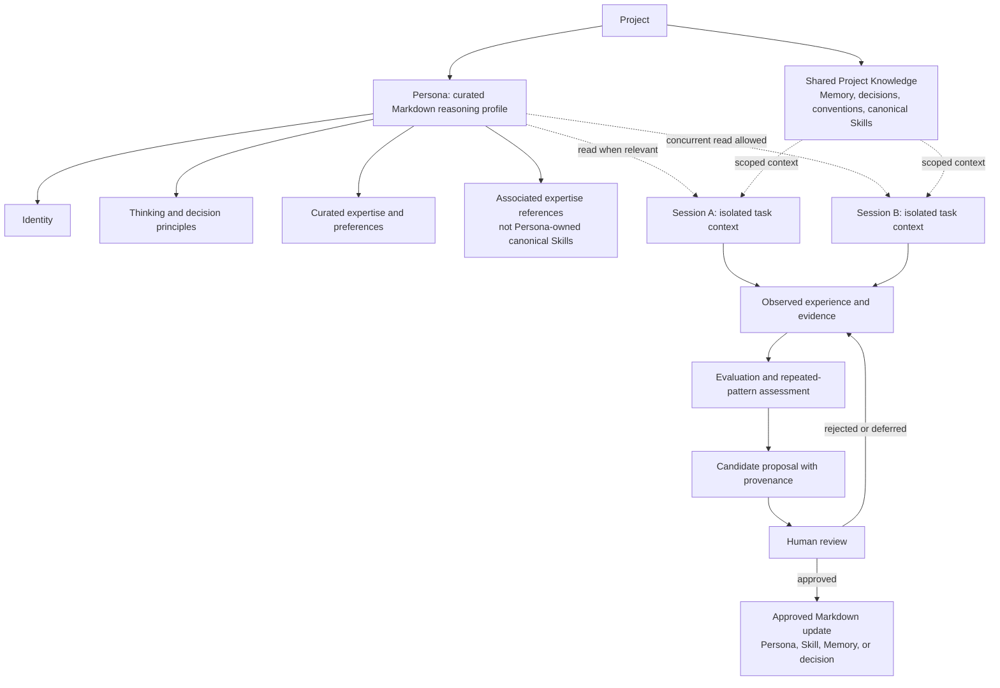

# Persona Architecture Review

> **Review conclusion:** NassAI-Praxis implements a Persona as a **versioned Markdown reasoning profile**. It is neither a running process nor an LLM, autonomous agent, memory engine, self-modifying runtime, or permanently active entity. The repository supports a human-governed *proposal process* for changing Persona definitions; it does not implement an automatic Persona-learning system.

> **Disposition:** The review’s required documentation clarifications were applied after this review. Current definitions and operational wording are in [`ARCHITECTURE.md`](ARCHITECTURE.md), [`PERSONAS.md`](PERSONAS.md), [`AGENT_PERSONA_COMPOSITION.md`](AGENT_PERSONA_COMPOSITION.md), and [`PERSONA_CONCURRENCY.md`](PERSONA_CONCURRENCY.md). The historical gaps and recommendations below explain why those corrections were necessary.

## 1. Executive Summary

This review inspected the implemented Persona directories, representative Persona and Agent definitions, project memory and Skill structures, graph and loop documents, architecture-freeze policy, knowledge-status policy, and the complete Persona Validation 001 protocol and evaluation. It also compared terminology with recent research and official coding-agent documentation without importing any external runtime design.[1] [2] [3] [4] [5] [6] [12] [13] [14] [15] [16] [17]

The proposed conceptual model is **substantially correct after two corrections**. A Persona has identity, thinking and decision principles, curated expertise, communication preferences, and references to relevant expertise. However, the repository does **not** implement Persona-owned dynamic memory, Persona-owned canonical Skills, or a cross-project transfer mechanism. The evidence supports one bounded Markdown-context reuse and human-governed, trial-only Skill lifecycle for Fatima; it does not support automatic learning, technically enforced concurrency exclusion, general coding-performance improvement, or portability across models and agents.[4] [5] [6]

The smallest required correction is documentation consistency, not architecture: a legacy concurrency-validation note makes technical-lock claims contradicted by the current policy and evidence. A concise clarification of the four Persona-local files and their boundary against project memory would make the public model unambiguous.[3] [5] [11]

## 2. Current Implementation

The repository contains ten concrete Persona directories—`amr`, `fatima`, `hassan`, `khaled`, `layla`, `nour`, `omar`, `sami`, `yasmin`, and `yousef`—each with `PERSONA.md`, `experience.md`, `preferences.md`, and `skills.md`; `personas/custom/README.md` is an extension guide rather than an eleventh Persona. The representative Fatima directory confirms this four-file pattern. Its base definition contains profile, communication style, technical preferences, a thinking layer, and a `proposal_then_review` mutation policy. Its three companion files contain authored background/expertise, preferences, and topic lists—not session records, automated retrieval indexes, or lifecycle-managed memory.[5]

Project knowledge is separately organized under `memory/working`, `memory/episodic`, `memory/semantic`, and `memory/procedural`, governed by classification, lifecycle, and status policies. Reusable procedures are separately represented as canonical `skills/<name>/SKILL.md` documents. Execution roles are separately represented as `agents/<name>/AGENT.md` documents. The declarative graph schema names these entities separately and documents their allowed relationships.[7] [8] [10]

| Area | Implemented form | Boundary |
|---|---|---|
| Persona | Versioned Markdown reasoning profile plus three curated local context files | No running state, scheduler, or automatic mutation |
| Agent | Markdown execution/workflow role used by a host coding agent | Not an autonomous Praxis runtime |
| Skill | Reusable, canonical Markdown procedure | Not Persona-owned merely because a Persona references expertise |
| Memory | Project-level Markdown knowledge layers with classification and lifecycle rules | Not a Persona-local dynamic store |
| Experience | A session observation/evidence record | Does not become durable knowledge automatically |
| Graph / loops | Declarative vocabulary and agent-followed methodology | Not graph or loop engines |

## 3. Canonical Persona Definition

A **Persona** is a Markdown-defined reasoning profile that may be selected when its perspective is materially relevant to a task. It supplies thinking style, priorities, decision principles, risk tolerance, recurring questions, expertise framing, and communication preferences. Its job is to make reasoning criteria explicit and reviewable; it does not own task execution, assert project truth, or substitute for verification.[1] [3] [5]

The validated canonical model is therefore:

```text
Persona =
    Identity
  + Thinking Principles
  + Expertise Framing
  + Decision Principles
  + Communication Preferences
  + Curated Persona-Local Context
  + Provenance for Proposed Durable Changes
```

The phrase **scoped knowledge** must be used carefully. In today’s repository it means static, authored, Persona-local context in the four-file directory and isolated trial records—not a dedicated live memory subsystem. A Persona can be composed with project memory and canonical Skills, but it does not own either category.[1] [3] [5] [6]

## 4. Persona vs Agent vs Skill vs Memory

Praxis’s composition rule is `Agent + Persona + Skill + Relevant Memory = Task Execution Context`. The selected external coding agent remains the execution host. This division matches official instruction-file mechanisms, which provide host-specific project context rather than a shared application runtime.[1] [14] [15] [16]

| Entity | Primary question | Canonical responsibility | What it is not |
|---|---|---|---|
| Persona | How should this task be reasoned about? | Perspective, priorities, trade-offs, risk questions, communication style | A worker, LLM, lock, or memory engine |
| Agent | Who performs or coordinates this responsibility? | Execution/workflow role and task ownership | A Persona or permanent identity container |
| Skill | Which repeatable method applies? | Steps, activation conditions, and success criteria | Evidence that a Persona possesses or owns the Skill |
| Memory | What does the project already know? | Classified, persistent project knowledge | Persona personality or an automatically updated store |
| Experience | What occurred in a specific work context? | Observed outcome and potential evidence | Approved reusable knowledge by default |
| Project knowledge | What has been accepted for this project? | Approved decisions, conventions, patterns, and procedures | Automatically portable global knowledge |

Recent empirical work provides an important caution: persona prompting should not be marketed as a general objective-task performance mechanism. The reviewed study found no statistically reliable general gain across its evaluated settings, so Praxis should continue to frame Personas as explicit reasoning and governance context, not as a performance guarantee.[12]

## 5. Persona Knowledge Scope

The repository provides a practical three-scope model, but only the **core** and **project** scopes have durable locations. A session scope is represented by isolated session records rather than Persona mutation.[3] [5] [6]

| Scope | Location today | Permitted content | Ownership and portability |
|---|---|---|---|
| Core Persona | `personas/<name>/PERSONA.md`, `experience.md`, `preferences.md`, `skills.md` | Authored identity, principles, curated background, preferences, expertise references | Versioned repository content; reusable only by deliberate copy/adoption and review |
| Project | `memory/`, project decisions, project Skills, project records | Classified project facts, conventions, decisions, procedures, evidence | Belongs to the project; another project must not silently inherit it |
| Session | `sessions/<session-id>/` or an isolated trial record | Task context, observations, evaluations, and proposals | Isolated; not a canonical update without review |

**Implemented boundary:** Persona-local `experience.md` is curated profile background. It is not the same as an `observed` work experience recorded by a session. This naming overlap is a documentation risk and should be clarified, not converted into an engine.

## 6. Persona Lifecycle

The implemented lifecycle is document-oriented. A maintainer creates or selects a Persona definition; a session may read it; the session keeps task context and observations outside the base definition; a durable change is proposed with evidence; and a human approves or rejects it before any canonical Markdown update.[2] [3] [6] [9]

```text
Curated Markdown Persona
        ↓ read when relevant
Session-specific task context and observations
        ↓ evidence-backed proposal only
Human review
        ↓ approved only
Updated canonical Markdown Persona
```

No component makes a Persona permanently active, assigns it exclusive runtime ownership, or automatically appends session history to it.

## 7. Experience and Learning Lifecycle

An **experience** begins as an observed session fact. It may update the appropriate project-memory layer only under the repository’s classification and security rules. A repeated, validated, generalizable pattern can become a candidate; a reviewed and approved candidate becomes durable project knowledge. The status ladder is `observed → candidate → reviewed → approved → deprecated` and requires evidence plus provenance for status changes.[7] [8] [9]

This is a **documented and governed learning workflow**, not autonomous continual learning. Research on continual LLM-agent learning commonly presumes runtime memory/action systems and update mechanisms that Praxis deliberately excludes. Praxis should therefore describe its model as *human-governed documentation evolution*, not as a deployed continual-learning architecture.[2] [13] [17]

## 8. Skill Acquisition Lifecycle

A Persona does not acquire a canonical Skill by itself. A session can use an existing canonical Skill when relevant. If repeated evidence suggests a reusable procedure, the proposed Skill follows the evolution path: evidence, pattern, candidate, evaluation, explicit human approval, authorized Markdown creation, and later read-only reuse.[8] [9]

Persona Validation 001 observed this lifecycle only in a bounded trial: three observations produced a candidate; the project owner explicitly authorized one trial-only Skill; and a fresh session later read and applied it. No canonical Persona, shared memory, or canonical Praxis Skill changed.[5] [6]

## 9. Persona Evolution

Persona evolution means a **human-approved change to a Persona’s canonical Markdown definition**. Valid targets are refinements such as a decision principle, recurring question, priority, anti-pattern, or boundary. The evidence loop requires a repeated pattern, successful outcomes, evaluation evidence, clear generalization, a proposal, validation, and human approval before promotion.[3] [8] [9]

| State | Meaning | May alter canonical Persona? |
|---|---|---|
| Observed | Session fact or evidence | No |
| Candidate | Proposed generalization with provenance | No |
| Reviewed | Checked but not active policy | No |
| Approved | Accepted durable project knowledge | Only through an approved Markdown change |
| Deprecated | Retained historical context, not current guidance | No automatic reuse |

Evolution is therefore **proposed, reviewed, and approved**. It is not automatic. The existing configuration explicitly disables auto-promotion, and the architecture freeze requires human-reviewed changes.[2] [4] [9]

## 10. Provenance and Knowledge Status

Durable Persona-, Skill-, Agent-, Pattern-, and Decision-related proposals must retain their evidence links, derivation, evaluation, status, and confidence. The reviewed knowledge-status policy requires a reviewed Markdown change for a status transition; a rejected candidate remains evidence rather than an active capability.[7] [9]

For Persona work, minimum provenance should identify the source sessions, selected Persona, relevant project context, evidence links, proposed scope, risks, reviewer, approval decision, and canonical file changed. This is a governance rule expressed in Markdown and Git history—not an automatic provenance service.[3] [6] [7]

## 11. Concurrent Persona Usage

Multiple sessions may **read** the same Persona concurrently. The base Persona file stays read-only during active work; each session writes only its own isolated context, observation, evaluation, or proposal. There is no lock, reservation, queue, daemon, or technical enforcement mechanism. The policy is safe coordination guidance only.[2] [3] [6]

Persona Validation 001 observed one compliant Markdown-coordination case: a second session discovered an active-work record, deferred overlapping work, and requested human direction. This proves policy awareness **when the record is discovered**, not atomic exclusion, universal discovery, or a technical concurrency guarantee.[4] [5] [6]

## 12. Cross-Project Reuse

The repository provides no explicit automatic cross-project Persona knowledge mechanism. A core Persona definition can be copied, linked, or deliberately adopted by another project, subject to that project’s review and policy. Project memory, project decisions, and project-specific experiences must remain attributable to their source project unless a human deliberately creates a reviewed, sanitized, and generalized reusable artifact.[3] [5] [6]

The reusable part of a Persona is its **definition**: identity, thinking and decision principles, preferences, and curated expertise framing. Project-specific experience is evidence tied to a project and session. A cross-project claim therefore requires separate provenance and validation; no such behavior is currently implemented or observed.

## 13. Graph Engineering Relationship

Graph Engineering is a declarative Markdown schema, not a graph engine. It models Personas as distinct entities: `Task → influenced_by → Persona` and `Agent → uses → Persona`. It separately models `Task → produces → Experience`, `Experience → updates → Memory`, `Experience → creates → Pattern`, and `Procedure → implemented_as → Skill`.[1] [2] [8]

This schema validates the separation of concerns in this review. It does **not** establish runtime retrieval, conflict resolution, automatic Persona updates, or any graph-database behavior.

## 14. Loop Engineering Relationship

Loop Engineering is an explicit methodology followed by the host coding agent: understand, plan, execute, verify, evaluate, record experience, detect a pattern, propose improvement, obtain human approval, and update Markdown. The Persona can influence reasoning at task time and may be a target of a reviewed refinement; it is not the loop executor.[1] [2] [9]

The proposed model is therefore corrected as follows: **Persona is an input to relevant execution and review loops; it is not a loop engine or self-improving actor.**

## 15. Evidence Already Demonstrated

| Classification | Bounded conclusion | Evidence boundary |
|---|---|---|
| **IMPLEMENTED** | Ten four-file Persona directories, project memory layers, separate canonical Skills and Agents, declarative graph/loop documents, and proposal-first policy | These are repository structures and policies, not runtime capabilities |
| **PROVEN BY EVIDENCE** | Fatima supplied scoped decision priorities; a fresh session reused Persona-scoped rationale; a human approval preceded one trial-only Skill; that Skill was later read and used; one second Persona respected attribution; one active-work marker produced a deferral response | One purpose-built OpenCode / Big Pickle case study only |
| **DOCUMENTED BUT UNPROVEN** | Concurrent read policy, proposal-first mutation, human-reviewed evolution, project-memory governance, graph relationships, and loop methodology | Documentation does not prove universal host behavior |
| **MISSING** | Technical concurrency enforcement, Persona dynamic-memory subsystem, automatic cross-project transfer, automatic evolution/promotion, multi-agent/multi-model replication, and outcome/performance proof | None should be inferred from the current documents |
| **PROPOSED** | Clarify local curated Persona files versus dynamic memory; replicate behavior using another existing Persona and harness | Requires separate human approval and evidence |

The canonical validation register explicitly classifies Persona Validation 001 as `observed`, not generalized, and limits it to a bounded behavioral case study.[4] [5]

## 16. Claims Not Yet Proven

The repository does not have evidence that Personas improve objective coding performance, quality, token efficiency, correctness, security, or general portability. It does not prove every coding-agent host discovers the relevant Persona, that two sessions always observe each other’s active-work records, or that source-project Persona knowledge safely transfers across projects. It also does not prove that a Persona has autonomous memory, retains state outside Markdown, or can modify itself.[4] [5] [12]

The legacy `docs/persona-concurrency-validation.md` makes stronger claims—“one active session,” “atomic acquire collision rejection,” and an “ephemeral lock path”—than the current policy and evidence support. Those statements conflict with the declared concurrent-read/no-runtime model and must not be treated as valid architecture evidence.[3] [5] [11]

## 17. Architecture Gaps

The following are **intentional non-implementations**, not defects: no runtime memory store, no lock service, no automatic retrieval, no automatic promotion, and no cross-project synchronization. The architecture freeze requires that such mechanisms not be added merely to resemble runtime-backed agent frameworks.[2]

The actual architecture gap is semantic clarity. The current four-file Persona layout uses `experience.md` and `skills.md` for curated profile material, while the broader repository uses **Experience** and **Skill** as lifecycle-governed entities. Without an explicit boundary statement, readers can mistake Persona-local authored context for dedicated Persona memory or canonical Skill ownership.

## 18. Documentation Gaps

| Priority | Gap | Evidence | Risk if retained |
|---|---|---|---|
| Required | `docs/persona-concurrency-validation.md` asserts an atomic one-session lock model | Conflicts with current concurrent-read policy and the bounded validation result | Readers infer an unimplemented runtime guarantee |
| Required | The four-file Persona layout is not explicitly distinguished from dynamic memory and canonical Skills in the central Persona guide | Fatima’s local files are curated text; policy/evidence place session observations elsewhere | Readers infer Persona-owned automatic memory or Skill acquisition |
| Recommended | `AGENTS.md` uses broad “persistent memory,” “continuous self-improvement,” and default-loading language that can be read as runtime behavior | Current architecture/evidence say retrieval is host- and task-dependent and auto-promotion is prohibited | Claims appear stronger and more deterministic than evidence |
| Recommended | Cross-project Persona reuse has no concise boundary statement | Protocol confines project knowledge and Persona-scoped trial records | Project evidence may be copied without attribution or approval |

## 19. Recommended Minimal Changes

This review implements **none** of the following changes. They are categorized for a later, separately approved decision.

| Category | Required repository change | Reason |
|---|---|---|
| **REQUIRED** | Correct or retire `docs/persona-concurrency-validation.md`; replace lock/atomic-acquire language with the observed Markdown coordination boundary | Removes a direct contradiction to current policy and evidence |
| **REQUIRED** | Add one concise “implementation boundary” section to `docs/PERSONAS.md`: each Persona directory has curated `PERSONA.md`, `experience.md`, `preferences.md`, and `skills.md`; these are not automatic dynamic memory, nor canonical Skill ownership; project memory and canonical Skills remain separate | Resolves the central semantic ambiguity without architecture change |
| **RECOMMENDED** | Align Persona, memory, loading, and evolution wording in `AGENTS.md` with `docs/ARCHITECTURE.md`, `docs/PERSONAS.md`, and `docs/VALIDATION_RESULTS.md` | Prevents deterministic/autonomous interpretations of agent behavior |
| **RECOMMENDED** | Add an explicit cross-project reuse note to the public Persona guide | Preserves attribution and prevents unsupported transfer claims |
| **RECOMMENDED** | Run a future independently designed replication using another existing Persona and a different coding-agent harness | Tests the bounded observation without changing Praxis |
| **NOT NEEDED** | Persona runtime, dynamic Persona-memory engine, lock server, queue, database, vector store, graph engine, loop engine, scheduler, daemon, or mandatory CLI | Prohibited by the architecture freeze and unsupported by current evidence |
| **NOT NEEDED** | Automatic Persona/Skill promotion or automatic cross-project knowledge synchronization | Violates the human-review and provenance model |

## 20. Explicit Non-Goals

Praxis does not promise a live Persona worker, a persistent autonomous entity, an LLM identity, a global memory system, a lock manager, automatic task routing, automatic knowledge retrieval, automatic self-modification, automatic Skill generation, or universal cross-project learning. It does not claim that all agents will load all relevant documents, that Personas always improve performance, or that documented policies are technically enforced.[1] [2] [3] [4] [5]

External systems may provide host-native memory or instruction-loading behavior, but those facilities belong to their respective hosts. They do not create a Praxis runtime or change the Markdown-first boundary.[14] [15] [16]

## 21. Final Architecture Diagram



> **Boundary:** the diagram describes a Markdown/Git governance flow. Its arrows do not represent a runtime, database, queue, lock, graph engine, loop engine, scheduler, or automatic mutation mechanism.

## 22. Acceptance Criteria

| Criterion | Result |
|---|---|
| Defines Persona, Agent, Skill, Memory, Experience, and project knowledge as separate concepts | Met |
| States where Persona-local material lives and distinguishes it from project memory | Met |
| Defines core, project, and session scope | Met |
| Specifies concurrent reading and proposal-first mutation without claiming a technical lock | Met |
| Defines evidence, Skill acquisition, evolution, provenance, and human approval boundaries | Met |
| Distinguishes implemented structures, observed evidence, documented-but-unproven claims, missing capabilities, and proposals | Met |
| Identifies claims stronger than evidence and minimal documentation corrections | Met |
| Preserves Markdown-first, agent-as-runtime, human-governed, no-runtime architecture | Met |
| Avoids changing Persona, Memory, Skill, Graph, Loop, or Architecture files | Met |
| Avoids commits and pushes | Met |

## References

[1]: [NassAI-Praxis Architecture](ARCHITECTURE.md)
[2]: [Architecture Freeze](ARCHITECTURE_FREEZE.md)
[3]: [Concurrent Persona Use and Safe Mutation](PERSONA_CONCURRENCY.md)
[4]: [Praxis Validation Results](VALIDATION_RESULTS.md)
[5]: [Persona Validation 001 — Results](../evidence/persona-validation-001/evaluation.md)
[6]: [Persona Validation 001 — Protocol](../evidence/persona-validation-001/PROTOCOL.md)
[7]: [Knowledge Status](../memory/knowledge-status.md)
[8]: [Praxis Relationship Vocabulary](../graph/relationships.md)
[9]: [Evolution Loop](../loops/evolution.md)
[10]: [NassAI Praxis — Development Methodology](../AGENTS.md)
[11]: [Legacy Persona Concurrency Validation](persona-concurrency-validation.md)
[12]: [Zheng et al. (2024), *When “A Helpful Assistant” Is Not Really Helpful: Personas in System Prompts Do Not Improve Performances of Large Language Models*](https://arxiv.org/abs/2311.10054)
[13]: [Zheng et al. (2025), *Lifelong Learning of Large Language Model Based Agents: A Roadmap*](https://arxiv.org/abs/2501.07278)
[14]: [Anthropic, *How Claude remembers your project*](https://code.claude.com/docs/en/memory)
[15]: [OpenAI, *Custom instructions with AGENTS.md*](https://learn.chatgpt.com/docs/agent-configuration/agents-md)
[16]: [GitHub, *Adding repository custom instructions for GitHub Copilot*](https://docs.github.com/copilot/customizing-copilot/adding-custom-instructions-for-github-copilot)
[17]: [He et al. (2025), *Enabling Self-Improving Agents to Learn at Test Time With Human-In-The-Loop Guidance*](https://aclanthology.org/2025.emnlp-industry.115/)
