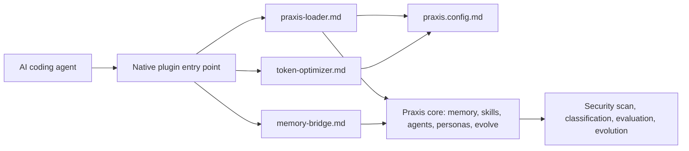

# NassAI-Praxis Plugin Architecture

Every agent integration exposes the same four-file pattern while respecting the host agent’s native entry point.

## Four-File Pattern

| File | Responsibility |
|---|---|
| `<AGENT>.md` or native instruction file | System-level identity, startup protocol, security, evaluation, evolution, and token policy. |
| `praxis-loader.md` | Ordered checklist for selecting and loading configuration, memory, skills, and post-task updates. |
| `memory-bridge.md` | Maps host-native memory or instruction features to Praxis’s project memory layers. |
| `token-optimizer.md` | Records the host context window, Praxis allocation, lazy-loading rules, summaries, and emergency mode. |

The canonical directories are `.claude/`, `.cursor/`, `.copilot/`, `.kimi/`, `.codex/`, `.gemini/`, `.opencode/`, `.pi/`, and `.windsurf/`. Native files such as root `.cursorrules` and `.github/copilot-instructions.md` remain thin mirrors or entry points; the Praxis files remain the source of truth.

## Symlinks or Copies

A project may copy the four plugin files into its repository for a self-contained setup, or symlink them to a centrally managed Praxis checkout when the host and filesystem support stable symlinks. Copies are safer for portable repositories and release snapshots; symlinks reduce duplication but must be checked by `praxis doctor` for broken targets. Never symlink private memory into a public project.

## Upgrade Path

When Praxis updates, review the changelog, compare the plugin directories with the new release, run the compatibility and agent tests, and then update copies or refresh symlink targets. Preserve local overrides in a separate project file rather than editing the generated core integration blindly. Re-run the security scan and `praxis doctor` after every upgrade.

## Customization

Users may override agent-specific settings in host-native files or a project-local companion file, but overrides cannot bypass memory security, classification, human review, or token safety. A customization should state its scope, precedence, owner, and rollback path. If it conflicts with semantic memory, follow `memory/conflict-resolution.md`.

## Relationship Diagram

The agent remains the runtime. The plugin is an adapter, and the Praxis core remains the human-readable project operating system.
