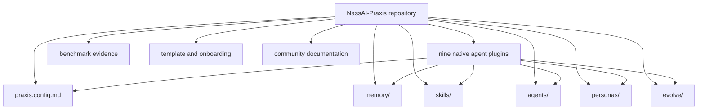

# NassAI-Praxis Unified Project Overview

NassAI-Praxis is one Markdown-first project. Its phases are delivery milestones within the same repository, not separate products, runtimes, or codebases. The repository’s configuration, memory, skills, agents, personas, evolution records, plugins, benchmark evidence, templates, and community documentation form one declarative knowledge and governance layer for AI coding agents.

## Unified Phase Map

The unified delivery contains **Phase 0**, **Phase 1**, **Phase 2**, **Phase 3**, and **Phase 4** as capabilities of the same project. There is no duplicate runtime and no phase-specific copy of the core.

| Phase | Capability added | Canonical project locations | How it is used now |
|---|---|---|---|
| 0 — Foundation | Configuration, memory layers, 29 skills, 12 agents, 10 personas, evolution templates | `praxis.config.md`, `memory/`, `skills/`, `agents/`, `personas/`, `evolve/` | Core source of truth loaded by every integration. |
| 1 — Benchmark | Laravel + Vue controlled comparison, transcripts, metrics, and report | `examples/laravel-vue-api/`, `benchmarks/benchmark-001/` | Evidence and regression reference; not a separate application product. |
| 2 — Hardening | Security gate, classification, token management, diagnostics, and conflict resolution | `memory/security/`, `memory/CLASSIFICATION.md`, `docs/praxis-doctor-*.md` | Protects writes, controls context, and keeps the framework self-governing. |
| 3 — Agent Integration | Native adapters for nine agents, compatibility matrix, and installation/testing docs | `.claude/`, `.cursor/`, `.copilot/`, `.kimi/`, `.codex/`, `.gemini/`, `.opencode/`, `.pi/`, `.windsurf/`, `docs/` | Connects each host environment to the same Praxis core. |
| 4 — Ecosystem | Template, onboarding, landing pages, contribution workflow, case study, FAQ, and launch content | `template/`, `GETTING_STARTED.md`, `CONTRIBUTING.md`, `docs/`, `benchmarks/benchmark-001/` | Makes the unified project discoverable, adoptable, and community-driven. |
| Graph + Loop | Logical relationships and explicit execution, learning, and evolution loops | `graph/`, `loops/`, `docs/graph-loop-example.md` | Connects knowledge to work as a declarative Markdown layer without adding a runtime. |

## Runtime Boundary

Praxis does not execute agents. It provides the Markdown definitions, knowledge, policies, and explicit loops that coding agents may follow in their own environments. Runtime execution, orchestration, queues, heartbeats, databases, and services are outside Praxis Core.

## Graph and Loop Layer

The graph and loops are additive capabilities inside the same project. `graph/` defines entities, controlled relationships, traversal, and safe integrity checks. `loops/` defines execution, learning, evolution, and lifecycle. They reuse the existing memory, skills, agents, personas, evaluation, and evolution structures.

## One Project, One Source of Truth

The agent is the runtime. The project root is the source of truth. A plugin must not fork memory, skills, personas, or evolution into a second project; it only adapts the host agent to the canonical files below.

## Runtime Flow

Native adapters instruct a selected agent to consult `praxis.config.md` and relevant project knowledge at task start, then to load only the skills, Persona, episodic events, and procedures that match the task. Actual retrieval and use are host- and task-dependent, so they must be recorded rather than presumed. During and after execution, agents apply the documented security procedure before memory writes, while evaluation and evolution retain reviewed Markdown records. Benchmark and ecosystem documents explain and test this behavior; they do not replace a runtime core.

## Repository Boundaries

| Boundary | Rule |
|---|---|
| Core | `praxis.config.md`, `memory/`, `skills/`, `agents/`, `personas/`, `evolve/`, `graph/`, and `loops/` are canonical and shared by all integrations. |
| Plugins | Native instruction directories contain adapters and must reference the same root core. |
| Personas | Concurrent reading of the same Persona is allowed. Canonical Persona changes require a proposal and human review; active-work records provide Markdown coordination rather than a runtime lock. |
| Evidence | `benchmarks/` records controlled evidence and case studies; it does not define runtime behavior. |
| Examples | `examples/` demonstrates framework use; it is not a second Praxis installation. |
| Template | `template/` is a starter snapshot for new projects and is intentionally smaller than the full root configuration. |
| Documentation | Root and `docs/` files explain, install, test, and evolve the same project. |

## Recommended Entry Points

| Goal | Start here |
|---|---|
| Understand the project | `README.md` and this document |
| Understand relationships and loops | `graph/README.md`, `loops/README.md`, and `docs/graph-loop-example.md` |
| Coordinate persona sessions | `docs/PERSONA_CONCURRENCY.md` and `sessions/` |
| Install an agent | `INSTALL.md` |
| Start in five minutes | `GETTING_STARTED.md` |
| Configure the core | `praxis.config.md` |
| Understand security | `memory/security/scan-procedure.md` |
| Test an agent integration | `docs/AGENT_TESTING.md` |
| Add a plugin | `docs/PLUGIN_ARCHITECTURE.md` |
| Contribute | `CONTRIBUTING.md` |
| Review validation | `docs/VALIDATION_INDEX.md` |
| Review benchmark evidence | `benchmarks/benchmark-001/report.md` |

## Integration Rule

When the framework changes, update the canonical root files first, then update affected plugin adapters, documentation, templates, and validation records. Do not create phase-specific copies of the same memory, skill, or agent definition. The changelog records phase history while the repository remains a single evolving project.

## Architecture Freeze and Evidence

The project is intentionally frozen as a Markdown-native layer. Read [`ARCHITECTURE.md`](ARCHITECTURE.md) for the one-page boundary, [`ARCHITECTURE_FREEZE.md`](ARCHITECTURE_FREEZE.md) for the change gate, [`VALIDATION_PROTOCOL.md`](VALIDATION_PROTOCOL.md) for baseline comparisons, and [`PORTABILITY_TEST.md`](PORTABILITY_TEST.md) for cross-agent evidence. The beginner-friendly [`examples/todo-api/`](../examples/todo-api/README.md) demonstrates the complete graph-and-loop path through four Markdown sessions.
