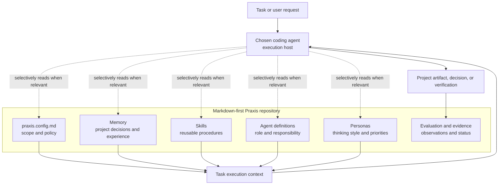
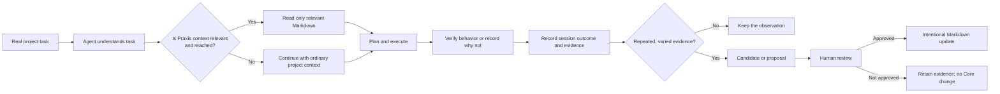
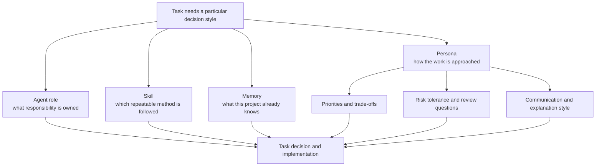
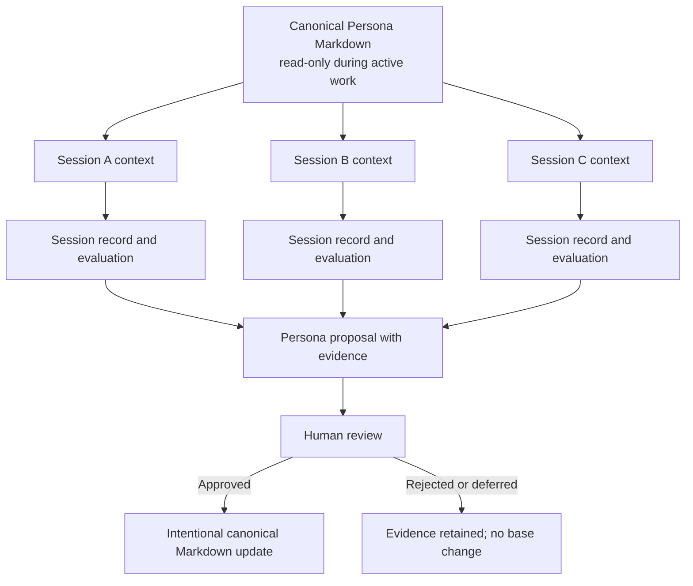

# How NassAI-Praxis Is Composed and Used

NassAI-Praxis is a **declarative project layer**. It does not run an agent. A coding agent remains the execution host; Praxis gives that host readable, reviewable material to consult when the task makes it relevant.

## 1. The Composition

> **Important:** the dashed arrows are intentionally selective. Praxis does not guarantee automatic retrieval; the host agent and the task determine whether a file is reached and used. The result should be recorded as evidence rather than assumed.

## 2. The Normal Work Loop

The loop is deliberately human-governed. A single session does not edit Core automatically. Evidence can remain `observed`, `inconclusive`, `not run`, or another documented status without becoming a feature.

## 3. What a Persona Adds

A Persona is not a second agent, a runtime process, or a lock. It is a shared Markdown definition of reasoning characteristics. It helps a task ask more consistent questions—for example, prioritizing safety, maintainability, user experience, or architectural trade-offs—while the **Agent** still owns the role, the **Skill** still supplies the procedure, and **Memory** still supplies project-specific knowledge.

## 4. Concurrent Persona Use, Safe Change

Multiple sessions may read the same Persona concurrently. They do not modify its canonical file while working. A durable Persona change needs provenance and human approval, not a technical lock or a background service. For the detailed policy, see [`PERSONAS.md`](PERSONAS.md) and [`PERSONA_CONCURRENCY.md`](PERSONA_CONCURRENCY.md).

## 5. Evidence Levels for Natural Use

| Level | Meaning | What it does **not** prove |
|---|---|---|
| E0 — No Observation | No opportunity to observe Praxis use, for example an infrastructure interruption. | A weakness or strength of Praxis. |
| E1 — Context Access | A task reached relevant Praxis context. | That the context influenced a decision. |
| E2 — Context Use | The task demonstrably used a knowledge item. | A better output or general value. |
| E3 — Behavioral Effect | The knowledge changed a concrete decision or implementation action. | A durable outcome improvement. |
| E4 — Outcome Effect | A verifiable outcome improved in the observed task. | General performance superiority. |
| E5 — Repeated Evidence | Comparable effects recur across varied independent work. | Automatic justification for an architecture change. |

This ladder keeps the project evidence-driven: it describes what was actually observed, not what the project hopes happened.
